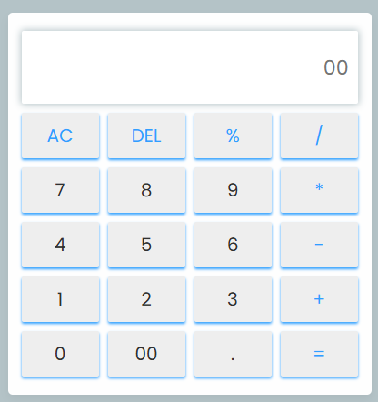

# Calculatore

### This is a simple calculatore build using html, css and js. this calculatore designed to perform basic mathematical operations such as addition, subtraction, multiplication, and divsion.

*This calculatore is also responsive and you can open it on your mobile phone.*

;

**in adition you can see my calculatore online.**
### click [here](https://calculator-delta-six-27.vercel.app/) to see online demo.

---
*mehranmohamadi1311@gmail.com*
